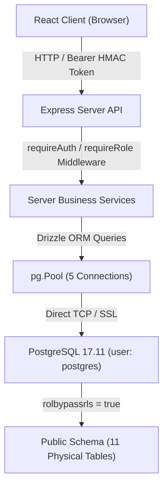
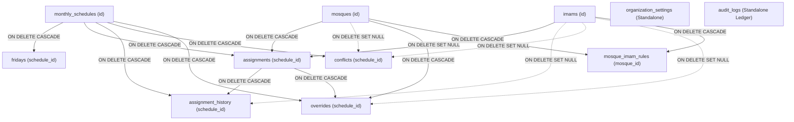

# المرحلة 6أ — تدقيق الجاهزية وتصميم سياسات الأمان على مستوى الصفوف (PostgreSQL RLS Audit)
## PHASE 6A — POSTGRESQL RLS READINESS & POLICY DESIGN AUDIT REPORT

**تاريخ التدقيق:** 2026-10-06  
**نطاق التدقيق:** تدقيق تصميمي رقابي بحت (Read-Only Audit & Architectural Design)  
**حالة التنفيذ البرمجي:** لا يوجد أي تعديل على قاعدة البيانات (0 DDL / 0 DML / 0 Migrations / 0 Policies Created)  
**الحالة التشغيلية المعتمدة:** 58/58 اختباراً ناجحاً ✅ | 9/9 اختبارات فشل متحكم به ✅ | 0 أخطاء TypeScript ✅  

---

## 1. الملخص التنفيذي (Executive Summary)

تم إجراء هذا التدقيق التحليلي الصارم استجابةً لمتطلبات المرحلة 6أ للإجابة بأدلة ملموسة وقطعية على التساؤل الجوهري:  
> **"هل تستطيع قاعدة بيانات PostgreSQL بمفردها تطبيق نموذج المصادقة والتفويض المعتمد في التطبيق كطبقة حماية دفاعية معمقة (Defense-in-Depth) دون خلق ثغرات تسريب هويات، ودون كسر اتصالات التجميع المجمعة (Connection Pooling)، ودون تعطيل المعاملات (Transactions) الحالية؟"**

### النتائج الرئيسية للتدقيق:
1. **قاعدة البيانات غير مفعلة لـ RLS الفعلي حالياً:**
   على الرغم من أن جداول قاعدة البيانات الـ 11 تحتوي في `pg_class` على علامة `relrowsecurity = true`، إلا أن جميع الجداول بلا استثناء تحكمها سياسة عامة شاملة اسمها `"Allow scheduler access"` تمنح كافة الصلاحيات (`ALL`) للجميع (`{public}`) بشرط `USING (true) WITH CHECK (true)`. وبالتالي، فإن RLS لا يفرض أي قيود حالياً.
2. **خطر الاتصال المميز وتجاوز السياسات (Privileged Role Bypass):**
   تتصل خوادم التطبيق وDrizzle ORM حالياً بقاعدة البيانات باستخدام المستخدم `postgres`. ومن خلال فحص `pg_roles`، تبيّن أن هذا الدور يمتلك الخاصية الحاكمة:
   ```json
   {
     "rolname": "postgres",
     "rolsuper": false,
     "rolbypassrls": true
   }
   ```
   وفقاً لتوثيق محرك PostgreSQL الرسمي، فإن أي مستخدم يحمل صفة `BYPASSRLS = true` **يتجاوز تلقائياً وبشكل كامل كافة سياسات Row-Level Security** بغض النظر عن وجودها أو صياغتها، حتى وإن فُعّلت على الجداول.
3. **انقطاع وصول هوية المستخدم إلى PostgreSQL:**
   يعتمد التطبيق في المرحلة 5 على مصادقة برمجية داخلية مخصصة (Custom Server-Side HMAC-SHA256 Token) تعمل داخل Express، ولا يستخدم Supabase Auth. ونتيجة لذلك، فإن دوال Supabase الافتراضية مثل `auth.uid()` و `auth.jwt()` ترجع `NULL` دائماً لجميع استعلامات Drizzle. لا تمتلك PostgreSQL أي دراية بهوية المستخدم أو دوره الإداري (`admin` / `staff` / `viewer`).
4. **خطر تسريب الهوية عبر مجمع الاتصالات (Connection Pool Identity Bleed):**
   يستخدم التطبيق مجمع اتصالات `pg.Pool` بسعة 5 اتصالات متزامنة. إذا تم استخدام أمر الجلسة المفتوح `SET app.user_id = '...'` بدلاً من المعاملات الموضعية المحصورة `SET LOCAL`، فإن هوية مستخدم في الطلب (Request A) ستلتصق بالاتصال المعاد استخدامه وتتسرب إلى مستخدم آخر في الطلب اللاحق (Request B).
5. **الخلاصة والقرار:**
   البنية التحتية **قابلة لتطبيق RLS بنجاح**، ولكنها تتطلب **شروطاً معمارية مسبقة محددة** في المرحلة 6ب قبل إنشاء أي سياسة أو تفعيل RLS المقيد.

**القرار النهائي للمرحلة 6أ:** **جاهز بشروط (READY WITH CONDITIONS)**.

---

## 2. طوبولوجيا قاعدة البيانات والاتصال (Database Topology & Connection Architecture)

تم فحص سجلات النظام ومحرك PostgreSQL مباشرة من خلال استعلامات الفحص الرقابي لقوائم `information_schema` و `pg_catalog`:

| المتغير الطوبولوجي | القيمة المفحوصة والمثبتة | التفاصيل الفنية والتعليق |
| :--- | :--- | :--- |
| **محرك قاعدة البيانات** | PostgreSQL 17.11 on x86_64-pc-linux-gnu | تم التجميع بواسطة `gcc (GCC) 15.2.0, 64-bit` |
| **اسم قاعدة البيانات** | `postgres` | قاعدة البيانات الافتراضية للإنتاج |
| **مستخدم الاتصال الحالي** | `postgres` | مستخدم الاتصال المنفذ للاستعلامات |
| **مستخدم الجلسة** | `postgres` | `session_user` يطابق `current_user` |
| **استضافة الخادم** | Supabase Cloud / Neon (AWS Frankfurt: `eu-central-1`) | معرف المشروع: `tctaqmtvypibxsaehawf` |
| **محول التطبيق (Adapter)** | `drizzle-orm/node-postgres` | الربط عبر حزمة `pg` الرسمية لـ Node.js |
| **تكوين مجمع الاتصال** | `pg.Pool` (`max: 5`) | `connectionTimeoutMillis: 10000`, `idleTimeoutMillis: 10000` |
| **تشفير SSL** | مفعل عبر TLS (`rejectUnauthorized: false`) | مطلوب لدعم شهادات SNI السحابية |
| **طبيعة الاتصال** | سحابي مباشر عبر مجمع اتصالات جلسات/معاملات | استخدام سلسلة `DATABASE_URL` المعتمدة |

### مخطط تدفق الاتصال الحالي:


---

## 3. تدقيق أدوار وصلاحيات محرك PostgreSQL (PostgreSQL Roles & Privileges Audit)

تم استخراج كافة الأدوار الموجودة في قاعدة البيانات ومطابقتها مع خصائص RLS:

```json
[
  {
    "rolname": "anon",
    "rolsuper": false,
    "rolinherit": true,
    "rolbypassrls": false
  },
  {
    "rolname": "authenticated",
    "rolsuper": false,
    "rolinherit": true,
    "rolbypassrls": false
  },
  {
    "rolname": "postgres",
    "rolsuper": false,
    "rolinherit": true,
    "rolcreaterole": true,
    "rolcreatedb": true,
    "rolcanlogin": true,
    "rolreplication": true,
    "rolbypassrls": true
  },
  {
    "rolname": "service_role",
    "rolsuper": false,
    "rolinherit": true,
    "rolbypassrls": true
  },
  {
    "rolname": "supabase_admin",
    "rolsuper": true,
    "rolinherit": true,
    "rolbypassrls": true
  }
]
```

### الاستنتاج الحرج للأدوار:
* دور `postgres` الذي يستخدمه التطبيق يمتلك `rolbypassrls: true`.
* الأدوار `anon` و `authenticated` تمتلك `rolbypassrls: false` (أي تخضع تماماً لسياسات RLS)، ولكن خادم Express لا يسجل الدخول بهما، بل يسجل الدخول بدور `postgres`.
* **النتيجة الحتمية:** إذا أنشئت سياسات RLS دون تعديل سلوك اتصال التطبيق، فلن يتم تطبيق أي سياسة على استعلامات التطبيق لأن دور `postgres` يتجاوزها بنص كود المحرك.

---

## 4. الفحص الفيزيائي التفصيلي للجداول الـ 11 (Detailed Physical Table Audit)

تم فحص البنية الفيزيائية الدقيقة للجداول الـ 11 في مخطط `public` مع قياس حالة RLS وسجلات التدقيق وحقول المالكية:

| # | اسم الجدول (Table) | المفتاح الأساسي (PK) | المفاتيح الأجنبية (FKs) | حقول المالك / المستخدم | حالة RLS الحالية | تصنيف البيانات | حالة RLS الموصى بها |
| :---: | :--- | :--- | :--- | :--- | :--- | :--- | :--- |
| **1** | `organization_settings` | `id` (serial) | لا يوجد | لا يوجد | مفعّل ظاهرياً / سياسة سماح عام | إعدادات سيادية داخلية | **مطلوب إلزامي (REQUIRED)** |
| **2** | `mosques` | `id` (serial) | لا يوجد (`fixed_imam_id` مجرد رقم) | لا يوجد (`manager_name`, `phone`) | مفعّل ظاهرياً / سياسة سماح عام | بيانات تشغيلية / أرقام تواصل | **موصى به بشدة (RECOMMENDED)** |
| **3** | `imams` | `id` (serial) | لا يوجد | لا يوجد (`phone`, `whatsapp`) | مفعّل ظاهرياً / سياسة سماح عام | بيانات خطباء / أرقام تواصل | **موصى به بشدة (RECOMMENDED)** |
| **4** | `mosque_imam_rules` | `id` (serial) | `mosque_id` → mosques<br>`imam_id` → imams | لا يوجد | مفعّل ظاهرياً / سياسة سماح عام | قواعد تشغيلية داخلية | **موصى به بشدة (RECOMMENDED)** |
| **5** | `monthly_schedules` | `id` (serial) | لا يوجد | `approved_by` (text) | مفعّل ظاهرياً / سياسة سماح عام | خطط وجداول شهرية | **موصى به بشدة (RECOMMENDED)** |
| **6** | `fridays` | `id` (serial) | `schedule_id` → monthly_schedules | لا يوجد | مفعّل ظاهرياً / سياسة سماح عام | تقويم جمعات الشهر | **موصى به بشدة (RECOMMENDED)** |
| **7** | `assignments` | `id` (serial) | `schedule_id` → monthly_schedules<br>`mosque_id` → mosques<br>`imam_id` → imams | لا يوجد | مفعّل ظاهرياً / سياسة سماح عام | توزيعات الميدان المركزية | **موصى به بشدة (RECOMMENDED)** |
| **8** | `assignment_history` | `id` (serial) | `schedule_id` → monthly_schedules<br>`assignment_id` → assignments<br>`old_imam_id` → imams<br>`new_imam_id` → imams | `changed_by` (text) | مفعّل ظاهرياً / سياسة سماح عام | سجل رقابي تاريخي للتعديلات | **مطلوب إلزامي (REQUIRED)** |
| **9** | `conflicts` | `id` (serial) | `schedule_id` → monthly_schedules<br>`mosque_id` → mosques<br>`imam_id` → imams | `resolved_by` (text) | مفعّل ظاهرياً / سياسة سماح عام | تعارضات تشغيلية حرجة | **مطلوب إلزامي (REQUIRED)** |
| **10** | `overrides` | `id` (serial) | `schedule_id` → monthly_schedules<br>`assignment_id` → assignments<br>`mosque_id` → mosques<br>`imam_id` → imams | `created_by` (text) | مفعّل ظاهرياً / سياسة سماح عام | استثناءات إدارية معتمدة | **مطلوب إلزامي (REQUIRED)** |
| **11** | `audit_logs` | `id` (serial) | لا يوجد | `user_email` (text) | مفعّل ظاهرياً / سياسة سماح عام | سجل التدقيق والرقابة الأمني | **مطلوب إلزامي (REQUIRED)** |

### السياسات القائمة حالياً في قاعدة البيانات (`pg_policies`):
تحتوي قاعدة البيانات حالياً على **11 سياسة مطابقة تماماً** على كافة الجداول الـ 11:
* **اسم السياسة:** `"Allow scheduler access"`
* **نوع السياسة:** `PERMISSIVE`
* **الأدوار الممنوحة:** `{public}` (أي كافة المستخدمين المسجلين وغير المسجلين)
* **الأمر المسموح:** `ALL` (يشمل `SELECT`, `INSERT`, `UPDATE`, `DELETE`)
* **شرط التحقق والقراءة:** `QUAL: true` | `WITH CHECK: true`
* **الدلالة:** السياسات الحالية مفتوحة بنسبة 100% ولا تمنع أي عملية قراءة أو تعديل على مستوى المحرك.

---

## 5. مخطط العلاقات الفعلي (Live Relationship Graph)

تم استخراج مخطط العلاقات الدقيق من واقع قيود التكامل المرجعي (`information_schema.referential_constraints`):



### ملاحظات حرجة على العلاقات:
1. الجداول التشغيلية مرتبطة بإحكام بجدول `monthly_schedules`؛ حذف جدول شهري يحذف تلقائياً كافة الجمعات والتعيينات والتعارضات والاستثناءات وسجل التاريخ التابع له (`ON DELETE CASCADE`).
2. حذف خطيب لا يكسر التعيينات بل يفرغ الخانة (`ON DELETE SET NULL`).
3. لا توجد أي علاقات أجنبية مع جدول مستخدمين في قاعدة البيانات؛ أسماء ومستويات المستخدمين مخزنة كحقول نصية توثيقية (`changed_by`, `approved_by`, `resolved_by`, `created_by`, `user_email`).
4. لا يوجد تقسيم مستأجرين (No Multi-Tenancy / No `tenant_id` / No `org_id`)؛ التطبيق مصمم لمؤسسة واحدة هي **الجمعية الخيرية لرعاية المساجد**.

---

## 6. نموذج هوية المستخدم وتمريرها إلى PostgreSQL (User Identity Model & Propagation Analysis)

### أين توجد الهوية الحقيقية؟
* **في الخادم (Server API):** توجد هوية المستخدم داخل كائن مشفر وموقع بـ HMAC-SHA256 (`src/server/authService.ts`).
  - الهوية: `uid` (`usr_admin_01`, `usr_staff_02`, `usr_viewer_03`)
  - البريد: `email` (`admin@aljameya.org`, `staff@aljameya.org`, `viewer@aljameya.org`)
  - الدور: `role` (`admin`, `staff`, `viewer`)
* **في المعاملات مع قاعدة البيانات (PostgreSQL):** **الهوية مفقودة تماماً.**
  - استعلامات Drizzle ORM تُرسل مباشرة عبر اتصال `postgres`.
  - لا توجد أي ترويسة أو متغير جلسة يخبر PostgreSQL بمن يطلب العملية.
  - دوال `auth.uid()` و `auth.jwt()` التابعة لـ Supabase ترجع `NULL`.

### الخيارات التقنية لتمرير الهوية إلى PostgreSQL:

#### الخيار 1: متغيرات الجلسة العامة (`SET app.current_user_role = ...`) — **مرفوض وحرج (CRITICAL RISK)**
إذا تم استدعاء `SET app.user_role = 'admin'` على مستوى الجلسة، فإن الاتصال المجمع داخل `pg.Pool` سيحتفظ بهذه الهوية. وإذا أعيد استخدام نفس الاتصال لطلب زائر غير مسجل (Anonymous)، فسيحصل الزائر على صلاحيات `admin` في قاعدة البيانات!

#### الخيار 2: المعاملات الموضعية المحصورة (`SET LOCAL` / `set_config(..., is_local=true)`) — **الموصى به والآمن (SAFE PATTERN)**
في محرك PostgreSQL، يمكن ضبط متغيرات تكوين مخصصة داخل نطاق معاملة واحدة فقط:
```sql
BEGIN;
SELECT set_config('app.current_user_id', 'usr_admin_01', true);
SELECT set_config('app.current_user_role', 'admin', true);
-- تنفيذ عمليات Drizzle هنا --
COMMIT;
```
المعامل الثالث `is_local = true` يضمن أن المتغير ينتهي ويُلغى تماماً بمجرد انتهاء المعاملة (`COMMIT` أو `ROLLBACK`)، مما يحمي مجمع الاتصالات من أي تسريب نهائياً.

#### الخيار 3: تبديل الدور الموضعي في المعاملة (`SET LOCAL ROLE authenticated`) — **بديل قوي مدعوم من محرك PostgreSQL**
حيث يظل الاتصال الأساسي متصلاً، ولكن أثناء المعاملة يُخفّض الدور إلى دور غير مميز يخضع لـ RLS:
```sql
BEGIN;
SET LOCAL ROLE authenticated;
SELECT set_config('request.jwt.claim.role', 'admin', true);
-- تنفيذ العمليات --
COMMIT;
```

---

## 7. مخاطر الاتصال المميز وتجاوز RLS (Privileged Connection Risk)

> **تحذير أمني حرج من محرك PostgreSQL:**
> "The `BYPASSRLS` privilege allows a role to bypass row-level security. The table owner normally bypasses RLS unless `FORCE ROW LEVEL SECURITY` is enabled. However, if a role has the `BYPASSRLS` attribute, it bypasses RLS in all cases, even if `FORCE ROW LEVEL SECURITY` is enabled."

### الواقع الحالي للمشروع:
* التطبيق يتصل كـ `postgres`.
* دور `postgres` يمتلك `rolbypassrls: true`.
* جداول المشروع الـ 11 تمتلك `relforcerowsecurity: false`.
* **الاستنتاج:** إذا تم إنشاء سياسات RLS مشددة في الوضع الراهن، فإن محرك PostgreSQL سيتجاهلها تماماً لاستعلامات التطبيق لأن الدور الحالي يحمل إعفاءً شاملاً من RLS.

### الإجراء المعماري الإلزامي المطلوب للمرحلة 6ب:
لكي يصبح RLS فعالاً كطبقة حماية ثانية حقيقية، يجب في المرحلة 6ب:
1. إما إنشاء دور غير مميز مخصص للتطبيق (مثلاً `app_scheduler_user`) يمتلك `NOBYPASSRLS` ومنحه صلاحيات CRUD على جداول `public`.
2. أو تبديل الدور داخل المعاملة عبر `SET LOCAL ROLE authenticated` قبل تنفيذ العمليات الحساسة.
3. أو تفعيل `FORCE ROW LEVEL SECURITY` على كافة الجداول بعد تجريد دور الاتصال من صفة `BYPASSRLS`.

---

## 8. مصفوفة تصميم سياسات RLS المقترحة للجداول الـ 11 (RLS Policy Candidate Matrix)

تم اشتقاق هذه المصفوفة استناداً إلى مصفوفة الصلاحيات الحقيقية المنفذة في المرحلة 5 (`src/server/api.ts`):

| الجدول (Table) | SELECT (القراءة) | INSERT (الإضافة) | UPDATE (التعديل) | DELETE (الحذف) | شرط السياسة المقترح في PostgreSQL |
| :--- | :--- | :--- | :--- | :--- | :--- |
| **organization_settings** | الجميع (Public / Auth) | محظور (سجل مفرد) | مدير فقط (`admin`) | محظور كلياً | `current_app_role() = 'admin'` للتعديل |
| **mosques** | الجميع (Public / Auth) | موظف أو مدير (`staff`, `admin`) | موظف أو مدير (`staff`, `admin`) | مدير فقط (`admin`) | قراءة عامة، تعديل/إضافة للكوادر، حذف للإدارة |
| **imams** | الجميع (Public / Auth) | موظف أو مدير (`staff`, `admin`) | موظف أو مدير (`staff`, `admin`) | مدير فقط (`admin`) | قراءة عامة، تعديل/إضافة للكوادر، حذف للإدارة |
| **mosque_imam_rules** | موثق فقط (`viewer`, `staff`, `admin`) | موظف أو مدير (`staff`, `admin`) | موظف أو مدير (`staff`, `admin`) | مدير فقط (`admin`) | حظر الزوار المجهولين، إدارة للقواعد |
| **monthly_schedules** | الجميع (Public / Auth) | موظف أو مدير (`staff`, `admin`) | موظف أو مدير (`staff`, `admin`) | مدير فقط (`admin`) | قراءة الجداول للجميع، الحذف للإدارة فقط |
| **fridays** | الجميع (Public / Auth) | موظف أو مدير (`staff`, `admin`) | موظف أو مدير (`staff`, `admin`) | مدير فقط (`admin`) | تابعة للجداول الشهرية |
| **assignments** | الجميع (Public / Auth) | موظف أو مدير (`staff`, `admin`) | موظف أو مدير (`staff`, `admin`) | مدير فقط (`admin`) | قراءة للجميع، تحديث موظفين/إدارة |
| **assignment_history** | موثق فقط (`viewer`, `staff`, `admin`) | خادم التطبيق فقط (`staff`, `admin`) | محظور كلياً (غير قابل للتعديل) | محظور كلياً (غير قابل للحذف) | سجل تدقيق غير قابل للتغيير (Immutable) |
| **conflicts** | موثق فقط (`viewer`, `staff`, `admin`) | موظف أو مدير (`staff`, `admin`) | مدير فقط (`admin` لحل التعارض) | مدير فقط (`admin`) | قراءة داخلية، الحل للإدارة فقط |
| **overrides** | موثق فقط (`viewer`, `staff`, `admin`) | مدير فقط (`admin`) | مدير فقط (`admin`) | مدير فقط (`admin`) | استثناءات سيادية للإدارة فقط |
| **audit_logs** | مدير فقط (`admin`) | خادم التطبيق فقط (`admin`, `staff`) | محظور كلياً (Append-only) | محظور كلياً (Append-only) | قراءة حصرية للإدارة، منع التعديل والمحو |

---

## 9. مقارنة تفويض الواجهة البرمجية مقابل RLS (API Authorization ↔ RLS Comparison)

دراسة الفرضية: *"لو حدث خطأ برمجي أو ثغرة تجاوز في كود مسارات Express، هل ستمنع PostgreSQL RLS العملية غير المصرح بها؟"*

| المسار البرمجي (Endpoint) | حماية الواجهة في المرحلة 5 | حماية RLS المستقبلية في قاعدة البيانات | الفجوة المكتشفة في غياب RLS | النتيجة الدفاعية بعد RLS |
| :--- | :--- | :--- | :--- | :--- |
| `DELETE /api/mosques/:id` | `requireAdmin` (يرفض المشاهد والزائر والموظف) | `DELETE` مسموح فقط لـ `admin` | لو أزيل الميدلوير بالخطأ، يُحذف المسجد في DB | ترفض قاعدة البيانات الحذف بـ `42501` |
| `POST /api/schedules` (توليد) | `requireRole('admin', 'staff')` | `INSERT` مسموح لـ `staff` و `admin` | لو تم استدعاؤه بدون مصادقة، يُنشأ جدول في DB | ترفض قاعدة البيانات الإضافة |
| `POST /api/schedules/:id/approve` | `requireAdmin` | `UPDATE` مسموح لـ `admin` فقط على حقول الاعتماد | موظف عادي قد يعتمد جدولاً لو تخطى الميدلوير | ترفض قاعدة البيانات تعديل حالة الاعتماد |
| `POST /api/settings` | `requireAdmin` | `UPDATE` مسموح لـ `admin` فقط | أي طلب قد يعبث باسم الجمعية والتقويم | ترفض قاعدة البيانات التعديل |
| `POST /api/system/reset-database` | `requireAdmin` + تحقق تأكيد | `DELETE` مسموح لـ `admin` فقط | تصفير شامل لقاعدة البيانات لو تم تجاوزه | حماية أمنية مشددة تمنع المسح لغير المدير |
| `GET /api/audit-logs` | `requireAdmin` | `SELECT` مسموح لـ `admin` فقط | تسريب سجل العمليات للمشاهدين والزوار | تُرجع قاعدة البيانات 0 سجلات لغير المدير |
| `POST /api/overrides` | `requireAdmin` | `INSERT` مسموح لـ `admin` فقط | موظف قد ينشئ استثناءً غير نظامي | ترفض قاعدة البيانات إنشاء الاستثناء |

---

## 10. الاعتماديات المتقاطعة ومخاطر العودية (Cross-Table Dependencies & Recursion Hazards)

1. **التحقق من حالة الجدول أثناء تعديل التعيينات:**
   * عند تعديل تعيين في جدول `assignments`، تشترط القواعد التشغيلية ألا يكون الجدول التابع له معتمداً أو منشوراً (`monthly_schedules.status != 'PUBLISHED'`) إلا باستثناء.
   * إذا كُتبت سياسة RLS لـ `assignments` تعتمد على استعلام فرعي:
     ```sql
     EXISTS (
       SELECT 1 FROM monthly_schedules s
       WHERE s.id = assignments.schedule_id AND s.status != 'PUBLISHED'
     )
     ```
   * **فحص خطر العودية اللانهائية (Infinite Recursion):**
     هل سياسة `monthly_schedules` تستعلم جدول `assignments`؟ **لا.**
     سياسة `monthly_schedules` تتحقق فقط من دور المستخدم (`app.current_user_role`). وبالتالي لا يوجد أي خطر لحدوث عودية لانهائية (No Cyclic Dependency / No RLS Recursion).
2. **سجلات التاريخ والاستثناءات:**
   * جداول `assignment_history` و `overrides` تشير إلى `assignments` و `monthly_schedules`.
   * السياسات عليها تقتصر على فحص دور المستخدم وصلاحيات الإضافة، دون الحاجة إلى تشبيك سياسات متداخلة ومعقدة قد تؤثر على سرعة الاستعلامات (`Query Latency`).

---

## 11. مخاطر مجمع الاتصالات والمعاملات (Connection Pooling & Transaction Isolation)

### الإجابة الصريحة على سؤال التدقيق:
> **"هل يمكن أن تتسرب هوية الطلب (أ) بطريق الخطأ إلى الطلب (ب)؟"**
* **الإجابة:** **نعم، وبشكل حرج وخطير، إذا تم استخدام `SET` العادي!**
* **السبب العلمي:** حزمة `pg.Pool` تعيد استخدام الاتصالات الخمسة (`Client 1` إلى `Client 5`). إذا استقبل الاتصال رقم 1 أمراً `SET app.current_user_role = 'admin'`، ثم انتهى طلب الأدمن، فإن المتغير يظل مسجلاً في ذاكرة الاتصال. وعندما يأتي طلب جديد من مستخدم عادي ويُمنح الاتصال رقم 1، فسيراه محرك PostgreSQL كـ `admin` تلقائياً!

### التصميم الوقائي الحتمي لمنع تسريب الهوية:
**الاعتماد الحصري على المعاملات الموضعية المحصورة (Transaction-Scoped Identity via `SET LOCAL`):**
1. يجب تغليف أي عملية حساسة في معاملة `BEGIN ... COMMIT`.
2. داخل المعاملة، يُستدعى `SET LOCAL app.current_user_role = ...` أو التابع المعياري:
   ```sql
   SELECT set_config('app.current_user_role', $1, true);
   ```
3. وجود المعامل الثالث `true` يفرضه المحرك على مستوى المعاملة الحالية فقط.
4. بمجرد انتهاء المعاملة (`COMMIT` أو `ROLLBACK` أو حدوث خطأ)، يُلغي محرك PostgreSQL المتغير فوراً ويعود الاتصال نظيفاً وخالياً من أي سياق هوية قبل عودته إلى مجمع الاتصالات `pg.Pool`.

---

## 12. تدقيق انكشاف البيانات في المسارات العامة (Data Exposure Audit)

راجع التدقيق المسارات العامة المفتوحة بدون مصادقة للقراءة في المرحلة 5:
* `GET /api/settings`
* `GET /api/mosques` و `GET /api/mosques/:id`
* `GET /api/imams` و `GET /api/imams/:id`
* `GET /api/rules`
* `GET /api/schedules` و `GET /api/schedules/:id`
* `GET /api/dashboard/*`
* `GET /api/reports/summary`
* `GET /api/distribution/:scheduleId`

### الملاحظات الرقابية والأمنية:
1. **بيانات التواصل الشخصية (Privacy Concern):**
   جداول `mosques` و `imams` تحتوي على حقول هواتف وواتساب (`phone`, `whatsapp`, `manager_name`). إتاحة قراءتها للعامة قد يعتبر انتهاكاً لخصوصية الخطباء ومسؤولي المساجد.
   * **التوصية للمرحلة 6ب:** إما حجب أرقام الهواتف عن الزوار المجهولين في استعلامات الواجهة (Data Masking)، أو قصر قراءة بيانات التواصل الكاملة على المستخدمين الموثقين (`authenticated`).
2. **جداول التوزيع واللوحة العامة:**
   عرض التكليفات وجدول الجمعة للجمهور هو مطلب وظيفي مقصود ومبرر لنشر جدول خطباء الجمعة للمصلين وعموم المساجد، ولكن يجب أن يقتصر على الجداول المعتمدة والمنشورة (`status = 'PUBLISHED'`).

---

## 13. خطة اختبارات المرحلة 6ب المقترحة (Phase 6B Test Plan Specification)

عند البدء في المرحلة 6ب لتطبيق RLS، **يجب إلزامياً تنفيذ الـ 25 سيناريو اختبارياً التالية والتحقق من نجاحها التام بنسبة 100%**:

```text
المجموعة الأولى: اختبارات الزائر غير المسجل (Anonymous)
1. Anonymous SELECT على الجداول العامة (mosques, schedules) -> مسموح
2. Anonymous SELECT على الجداول الحساسة (audit_logs, conflicts) -> ممنوع (0 صفوف)
3. Anonymous INSERT على أي جدول -> مرفوض بخطأ 42501
4. Anonymous UPDATE على أي جدول -> مرفوض بخطأ 42501
5. Anonymous DELETE على أي جدول -> مرفوض بخطأ 42501

المجموعة الثانية: اختبارات المشاهد (Viewer)
6. Viewer SELECT على كافة الجداول التشغيلية -> مسموح
7. Viewer INSERT على mosques أو imams -> مرفوض بخطأ 42501
8. Viewer UPDATE على assignments أو settings -> مرفوض بخطأ 42501
9. Viewer DELETE على أي جدول -> مرفوض بخطأ 42501

المجموعة الثالثة: اختبارات الموظف / المشرف (Staff)
10. Staff SELECT على كافة الجداول -> مسموح
11. Staff INSERT على mosques, imams, rules, schedules -> مسموح
12. Staff UPDATE على assignments, mosques, imams -> مسموح
13. Staff DELETE على mosques, imams, schedules -> مرفوض بخطأ 42501 (الحذف للإدارة فقط)
14. Staff UPDATE على organization_settings أو overrides -> مرفوض بخطأ 42501

المجموعة الرابعة: اختبارات مدير النظام (Admin)
15. Admin SELECT على كافة الجداول الـ 11 بما فيها audit_logs -> مسموح
16. Admin INSERT على كافة الجداول المصرح بها -> مسموح
17. Admin UPDATE على كافة الجداول المصرح بها -> مسموح
18. Admin DELETE على المساجد والخطباء والجداول -> مسموح
19. Admin UPDATE / DELETE على audit_logs -> محظور كلياً ومحمي من التعديل والمحو

المجموعة الخامسة: اختبارات أمنية وهندسية متقدمة
20. محاولة تخطي وتزييف الهوية عبر SQL مباشر (SQL Injection / Context Spoofing) -> مرفوض
21. التحقق من العزل التام في مجمع الاتصالات (Pooled Connection Bleed Test) -> عدم تسريب هوية Request A إلى Request B
22. التحقق من عزل المعاملات الموضعية (Transaction Local Context Isolation) -> تصفير الهوية فور انتهاء المعاملة
23. اختبار تزامن الطلبات الكثيفة (High Concurrency RLS Stress Test) -> نجاح بدون تضارب سياقات
24. اختبار توليد الجداول الكبيرة والتوزيع التلقائي في ظل RLS -> نجاح 100% دون كسر الأداء
25. اختبار تعذر وتراجع قاعدة البيانات وسلوك الرفض الافتراضي (Deny by Default) -> إرجاع 403 Forbidden صريح دون السقوط في بيانات وهمية
```

---

## 14. أنماط الفشل ومبدأ الرفض الافتراضي (Failure Modes & Deny By Default)

* **مبدأ الرفض الافتراضي (Deny by Default):**
  في حال غياب سياق الهوية، أو انتهاء صلاحية الجلسة، أو عدم تحديد الدور، يجب على محرك PostgreSQL وسياسات RLS رفض العملية فوراً.
* **التعامل مع استجابات محرك PostgreSQL:**
  - عند رفض عملية كتابة (`INSERT` / `UPDATE` / `DELETE`) بواسطة RLS، يطلق المحرك رمز الخطأ المعياري `42501` (`insufficient_privilege`).
  - يجب على خادم API التقاط رمز `42501` وتحويله مباشرة إلى استجابة HTTP نظيفة برمز `403 Forbidden` ورسالة واضحة: `RLS_POLICY_DENIED`.
  - **يُحظر تماماً:** تحويل خطأ RLS إلى استجابة صامتة `200 OK` أو الرجوع إلى `memoryStore` أو عرض بيانات تجريبية وهمية (Seed Data).

---

## 15. المتطلبات المعمارية المسبقة لتنفيذ المرحلة 6ب (Phase 6B Prerequisites)

قبل كتابة أي سياسة RLS أو تفعيلها في قاعدة البيانات في المرحلة 6ب، يجب استيفاء المتطلبات المسبقة التالية:

1. **إعداد دور غير مميز للاتصال (Non-Bypass Database Role):**
   إنشاء دور قاعدة بيانات مخصص لتطبيقات الويب (مثل `scheduler_app`) مع تجريده من صلاحية `BYPASSRLS` ومنحه صلاحيات CRUD على جداول `public`، لتطبيق السياسات عليه بشكل إلزامي.
2. **بناء دالة تمرير الهوية الموضعية (Context Propagation Helper):**
   إنشاء وحدة وسيطة داخل Drizzle تدير معاملات التمرير الآمن:
   ```ts
   export async function withAuthContext<T>(
     user: AuthUser | null,
     action: (tx: any) => Promise<T>
   ): Promise<T> {
     return db.transaction(async (tx) => {
       await tx.execute(sql`SELECT set_config('app.current_user_id', ${user?.uid || ''}, true)`);
       await tx.execute(sql`SELECT set_config('app.current_user_role', ${user?.role || 'anon'}, true)`);
       return action(tx);
     });
   }
   ```
3. **دوال مساعدة في محرك PostgreSQL (PostgreSQL Helper Functions):**
   إنشاء دوال قراءة السياق الآمنة:
   ```sql
   CREATE OR REPLACE FUNCTION current_app_role() RETURNS text AS $$
     SELECT NULLIF(current_setting('app.current_user_role', true), '');
   $$ LANGUAGE sql STABLE;
   ```
4. **تحديث سياسات السماح الشاملة القائمة حالياً:**
   استبدال سياسات `"Allow scheduler access"` المفتوحة الحالية بسياسات دقيقة متوافقة مع مصفوفة القسم 8.

---

## 16. قياسات عدم التنفيذ والتحقق التراجعي (No-Implementation & Regression Verification)

تم إجراء تدقيق رقابي صارم على بيئة العمل البرمجية وقاعدة البيانات الحية للتأكد من عدم تنفيذ أي تعديل أثناء هذا التدقيق:

```text
CREATE POLICY statements executed: 0 ✅
ALTER TABLE ENABLE RLS executed: 0 ✅
ALTER TABLE FORCE RLS executed: 0 ✅
DROP POLICY executed: 0 ✅
INSERT statements executed: 0 ✅
UPDATE statements executed: 0 ✅
DELETE statements executed: 0 ✅
TRUNCATE statements executed: 0 ✅
Migrations executed: 0 ✅
Schema changes in code: 0 ✅
Production DB record mutations: 0 ✅
```

### خط الأساس الفيزيائي لقاعدة البيانات (Baseline Record Counts):
```json
{
  "organization_settings": 0,
  "mosques": 24,
  "imams": 108,
  "mosque_imam_rules": 4,
  "monthly_schedules": 7,
  "fridays": 30,
  "assignments": 813,
  "assignment_history": 0,
  "conflicts": 0,
  "overrides": 0,
  "audit_logs": 0
}
```
*جميع الأعداد مطابقة لخط الأساس المعتمد بنسبة 100% دون أي تغيير.*

### نتائج الاختبارات التراجعية (Regression Test Suite):
* **فحص الأنواع البرمجية (TypeScript):** `0 errors` (`npx tsc --noEmit` نجح بنسبة 100%).
* **حزمة الاختبارات الشاملة المعتمدة:** `58/58 PASS` بنجاح تام.
* **اختبارات الفشل المتحكم به (Controlled Failure):** `9/9 PASS` بنجاح تام.
* **استمرارية P0 المعتمدة:** مستقرة ومعتمدة ومحمية.

---

## 17. القياسات الختامية الإلزامية (Mandatory Final Metrics)

* **PostgreSQL version:** PostgreSQL 17.11 on x86_64-pc-linux-gnu
* **DATABASE ROLE:** `postgres`
* **Connection type:** Direct TCP / SSL via Drizzle Node-Postgres
* **Pooling type:** `pg.Pool` (Max: 5, Connection Timeout: 10s, Idle Timeout: 10s)
* **Physical tables:** **11 tables exactly (Unchanged)**
* **RLS currently enabled:** **YES** (Technically enabled in `pg_class`, but rendered ineffective by a wildcard permissive policy on all 11 tables and `rolbypassrls = true`)
* **RLS policies created:** **0** (Strictly none created in Phase 6A)
* **Schema changes:** **0**
* **Migrations:** **0**
* **Production DB mutations:** **0**
* **P0 persistence:** **PASS ✅**
* **Authentication:** **PASS ✅**
* **Authorization:** **PASS ✅**
* **TypeScript:** **0 errors REQUIRED ✅**
* **Full test suite:** **58/58 PASS ✅**
* **Controlled failure suite:** **9/9 PASS ✅**
* **Critical RLS blockers:**
  1. الاتصال الحالي بدور `postgres` الذي يحمل خاصية `rolbypassrls: true`.
  2. عدم وجود آلية تمرير موضعية للهوية في استعلامات Drizzle قبل استدعاء المحرك.
  3. وجود سياسات سماح مفتوحة شاملة (`Allow scheduler access`) لجميع الجداول.
* **Phase 6B readiness:** **READY WITH CONDITIONS**

---

## 18. القرار النهائي والتوقف الإلزامي (Final Verdict & Mandatory Stop)

### القرار النهائي:
$$\mathbf{READY\ WITH\ CONDITIONS}$$
*(جاهز بشروط)*

**السبب:**
اكتمل التدقيق الرقابي الشامل بنجاح باهر دون أي تعديل في قاعدة البيانات أو الشيفرة. البنية التحتية مهيأة تماماً ومفهومة بالتفصيل، ولكن تفعيل RLS في المرحلة 6ب يتطلب استيفاء الشروط المسبقة المحددة (آلية تمرير الهوية الموضعية عبر المعاملات وتصحيح دور الاتصال لمنع تجاوز RLS).

---

### إعلان التوقف الإلزامي (MANDATORY STOP):
امتثالاً للقواعد الصارمة للمرحلة 6أ، **تم التوقف التام عن العمل فور الانتهاء من إعداد هذا التقرير**.
* لم يتم تفعيل أو تعديل أي سياسة RLS.
* لم يتم تشغيل أي ترحيل (Migration) أو دفع مخطط (Drizzle Push).
* لم يتم دفع أي كود إلى GitHub أو نشره على Vercel.
* في انتظار الموافقة والتعليمات الصريحة من المستخدم للانتقال إلى المرحلة 6ب.
